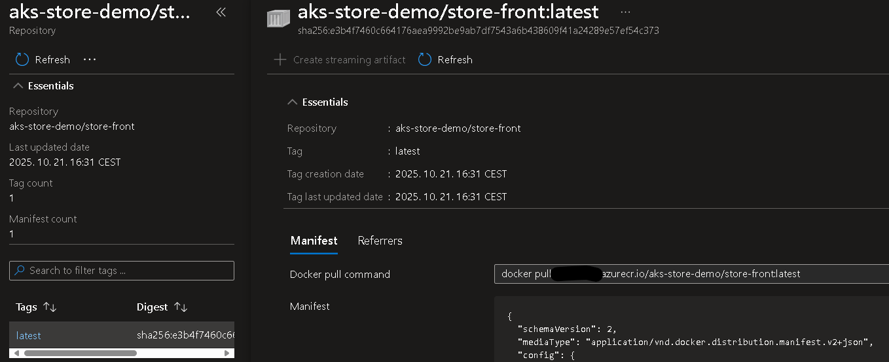

# 04 - Azure Kubernetes Services

*Nincs frissítve a 2025. őszi félévre!*

## Cél

A labor célja megismerni:

 - az AKS szolgáltatást és a legfontosabb kapcsolódó szolgáltatásokat (ACR)
 - az AKS alkalmazások telepítésének különböző módszereit
 - az AKS legalapvetőbb megfigyelési funkcióit

## Előkövetelmények

A laborleírás cross-platform eszközöket használ. A labor Linuxon (Kubuntu) lett kidolgozva.

- Korábbi laborok infrastruktúrájából: `docker`, `docker compose`, `helm`
    - Windows-on is [linux konténer módban](https://learn.microsoft.com/en-us/virtualization/windowscontainers/deploy-containers/set-up-linux-containers#run-your-first-linux-container) 
- Azure [hallgatói előfizetés](https://azure.microsoft.com/en-us/free/students)
- [Azure CLI](https://learn.microsoft.com/en-us/cli/azure/install-azure-cli) v2.61 vagy újabb
- Azure [kubelogin és kubectl](https://azure.github.io/kubelogin/install.html)
    - az `az aks install-cli` felülírhatja a korábban telepített `kubectl` binárist
- Docker Hub eléréshez Docker Hub fiók és [Personal Access Token](https://docs.docker.com/security/access-tokens/#create-a-personal-access-token)


## Előkészület

A feladatok megoldása során ne felejtsd el követni a feladat beadási folyamatát [GitHub](../../information/GitHub.md).

!!! danger "PR név"
    :exclamation: A beadásnál a pull request neve legyen: *hf4* :exclamation:

### Git repository létrehozása és letöltése

1. Moodle-ben keresd meg a laborhoz tartozó meghívó URL-jét és annak segítségével hozd létre a saját repository-dat.
2. Várd meg, míg elkészül a repository, majd checkout-old ki.
3. Hozz létre egy új ágat `megoldas` néven, és ezen az ágon dolgozz.
4. A `neptun.txt` fájlba írd bele a Neptun kódodat. A fájlban semmi más ne szerepeljen, csak egyetlen sorban a Neptun kód 6 karaktere.

!!! danger "NEPTUN"
    :exclamation: A feladatokban a `neptun` kifejezés helyett a saját neptunkódunkat helyettesítsük be minden esetben :exclamation:

## 0. Feladat

### Azure portál ajánlott beállítások

1. Lépjünk be az [Azure portálra](https://portal.azure.com).

2. Jobb felül nyissuk meg a beállításokat (fogaskerék ikon).

3. Állítsuk a [nyelvi beállításokat](https://learn.microsoft.com/en-us/azure/azure-portal/set-preferences#language--region) (felülről a harmadik menüpont). A nyelv legyen angol, a régiós formátum legyen magyar. Az **Apply** gombbal alkalmazzuk a beállításokat.

4. Visszatérve a portál beállításokhoz, nyissuk meg a [tenantjaink listáját](https://learn.microsoft.com/en-us/azure/azure-portal/set-preferences#directories--subscriptions) (felülről az első menüpont, *Directories + subscriptions*). Ellenőrizzük a táblázatban, hogy a BME tenant-e az aktív (*Current*) tenantunk. Ha nem, a **Switch** gombbal váltsunk át rá.

### Azure előfizetés ellenőrzése

1. Nyissuk meg az [előfizetések listáját](https://learn.microsoft.com/en-us/azure/azure-portal/get-subscription-tenant-id#find-your-azure-subscription): a keresőben vagy a bal oldali menüben keressük ki a *Subscriptions* oldalt és nyissuk meg.

2. Több előfizetést is láthatunk egy táblázatban, a hallgató előfizetésünk *Azure for Students* néven jön létre és a szerepkörünk (*My role*) *Account admin* vagy *Owner*. Nyissuk meg a hallgatói előfizetésünket.

3. Az áttekintő oldalról (*Overview*) az előfizetés azonosítóját (*Subscription ID*) érdemes elmenteni, mert gyakran lesz rá szükség.

4. Ugyanezen az oldalon van egy [link a hallgatói kreditjeinket kezelő oldalra](https://www.microsoftazuresponsorships.com/). Ezen a külső oldalon ellenőrizzük, hogy megvan-e a 100$-nyi kreditünk (*Check your balance*).

!!! warning "Azure költségek"
    Ha költséges erőforrásokat hoztunk létre, akkor különösen fontos rendszeresen ellenőrizni ezen az oldalon a maradék keretünket.

### Azure CLI ellenőrzése

1. Ellenőrizzük a verziószám(ok) kiírásával, hogy az Azure CLI elérhető-e.
    ```bash
    az version
    ```

2. Parancssorból [csatlakozzunk az Azure előfizetésünkhöz](https://learn.microsoft.com/en-us/cli/azure/authenticate-azure-cli-interactively). Csatlakozáskor listázódnak az előfizetések, válasszuk a hallgatói előfizetést.
    ```bash
    az login
    ```
   
    !!! tip "Aktuális előfizetés az Azure CLI-ben"
        Az Azure CLI parancsok általában nem kérik be az előfizetés azonosítóját, hanem egy globális beállításból veszik, amit belépéskor (`az login`) is beállítódik. Fontos, hogy mindig a megfelelő előfizetés legyen beállítva. Az `az account set -s <előfizetés azonosító>` paranccsal tudunk előfizetést váltani.

!!! danger "Közös Azure régió"
    Fontos, hogy minden Azure erőforrás lehetőleg azonos régióban legyen. Ez a közös régió lehetőleg **North Europe** legyen. Ha bármilyen okból ezt nem tudod tartani, akkor is az erőforrásaid ugyanabban az európai régióban legyenek (pl. *Germany West Central*). 

### Erőforráscsoport létrehozása

Hozz létre új erőforráscsoportot [ezen útmutatót követve](https://learn.microsoft.com/en-us/azure/azure-resource-manager/management/manage-resource-groups-portal#create-resource-groups) a hallgató előfizetés alá *viaumb11* néven a közös Azure régióban (lásd fentebb).

!!! danger "Alapértelmezett Azure erőforráscsoport"
    A továbbiakban ezt az erőforráscsoportot add meg minden Azure erőforrás létrehozásakor.

## 1. Feladat

### AKS bevezető - mintaalkalmazás helyi kipróbálása

A labor során a hivatalos AKS bevezető gyakorlatot követjük némi módosítással. Az [első rész](https://learn.microsoft.com/en-us/azure/aks/tutorial-kubernetes-prepare-app?tabs=azure-cli) egy példaalkalmazást mutat be.

Kövesd az útmutatót, mely a korábbi gyakorlatokon megismert `docker` és `docker compose` parancsokat használ.

### Azure Container Registry létrehozása

A hivatalos útmutató [második része](https://learn.microsoft.com/en-us/azure/aks/tutorial-kubernetes-prepare-acr?tabs=azure-cli) egy Azure Container Registry konténer tároló Azure CLI-ből történő létrehozásáról és feltöltéséről szól. Kezdő Azure használóknak inkább az Azure portál ajánlott, mert ott szemléletesebben látszódik minden beállítás. Emiatt inkább az [Azure portálos útmutatót](https://learn.microsoft.com/en-us/azure/container-registry/container-registry-get-started-portal?tabs=azure-cli#create-a-container-registry) kövesd, az alábbi beállításokkal:

- Name: *acr* előtag + neptun kód (pl.*npt123* neptun kód esetén *acrnpt123*)
- Resource group: az alapértelmezett Azure erőforráscsoport (lásd fentebb)
- Location: közös Azure régió (lásd fentebb)
- Domain name label scope: Unsecure
- Pricing plan / SKU: Basic
- Role assignment permission mode: RBAC Registry Permissions

Azure CLI-vel (`az acr login`) [regisztráljuk is az ACR-t a docker környezetünkbe](https://learn.microsoft.com/en-us/cli/azure/acr?view=azure-cli-latest#az-acr-login) tárolóként.

### Konténerek feltöltése ACR-be

A hivatalos útmutató [második része](https://learn.microsoft.com/en-us/azure/aks/tutorial-kubernetes-prepare-acr?tabs=azure-cli) az ACR build szolgáltatását használja, amivel könnyen lehetne a fejlesztői gép erőforrásait kímélve a lemezképeket megépíteni. Az építéshez szükséges kontextust (forráskód, YAML) tölti csak fel, a kiinduló lemezkép és az építési folyamat is az ACR-en belül történik. Sajnos ez a szolgáltatás [jelenleg csak fizetős Azure előfizetésekben érhető el](https://learn.microsoft.com/en-us/azure/container-registry/container-registry-tasks-overview), hallgatóiban nem. Szerencsére az első feladatrész során a lemezképek elkészültek, így [azokat feltölthetjük](https://docs.docker.com/get-started/docker-concepts/building-images/build-tag-and-publish-an-image/).

!!! warning "Lemezkép architektúrák"
    A lemezkép CPU architektúrájának [kompatibilisnak kell lennie](https://docs.docker.com/build/building/multi-platform/#why-multi-platform-builds) a Docker környezet CPU architektúrájával (AKS esetén ez alapesetben: `linux/amd64`). Linuxos és Windows-os fejlesztői környezetben is általában linuxos Docker környezetet használunk, így általában nem lesz ebből gondunk (`docker image inspect <lemezkép név vagy id>` paranccsal ellenőrizhetjük: az *Architecture* tulajdonságot figyeljük). Viszont például ARM64 CPU-s Mac esetében gond lehet, a fejlesztői gépen készített lemezkép AKS-en nem fog jól működni. Ilyenkor a legegyszerűbb linuxos lemezképet készíttetni az AKS számára, amit például a `DOCKER_DEFAULT_PLATFORM` [környezeti változó beállításával tehetünk meg](https://stackoverflow.com/questions/65612411/forcing-docker-to-use-linux-amd64-platform-by-default-on-macos). Az így készült lemezkép csak egy platformot támogat. Többplatformos lemezképet is [készíthetünk](https://docs.docker.com/build/building/multi-platform/#build-multi-platform-images) a *buildx* docker CLI plugin-nal, így ugyanaz a lemezkép több architektúrán is használható.

1. Tag-eljük meg az alábbi három *aks-store-demo* lemezképet. Az $ACRNAME helyére helyettesítsük be az ACR-ünk nevét (*acr+neptun kód*).

    ```bash
    docker tag aks-store-demo-product-service $ACRNAME.azurecr.io/aks-store-demo/product-service
    docker tag aks-store-demo-store-front $ACRNAME.azurecr.io/aks-store-demo/store-front
    docker tag aks-store-demo-order-service $ACRNAME.azurecr.io/aks-store-demo/order-service
    ```

2. Töltsük fel a képeket.

    ```bash
    docker push $ACRNAME.azurecr.io/aks-store-demo/store-front
    docker push $ACRNAME.azurecr.io/aks-store-demo/order-service
    docker push $ACRNAME.azurecr.io/aks-store-demo/product-service
    ```
   
!!! tip "ACR által használt tárhely"
    Az ACR Azure portálos oldalán belül a *Metrics* menüpontban a *Storage used* nevű [metrikát](https://learn.microsoft.com/en-us/azure/container-registry/monitor-container-registry-reference#supported-metrics-for-microsoftcontainerregistryregistries) kiválasztva ellenőrizhetjük az ACR által használt tárhelyet, illetve annak időbeli változását. Másik lehetőség az *Overview* menüponton belül a *Monitoring* alfül.


Az útmutató nem tér ki rá, de a teljesség kedvéért foglalkozzunk még egy lemezképpel. AKS-be az [aks-store-quickstart.yaml](https://github.com/Azure-Samples/aks-store-demo/blob/main/aks-store-quickstart.yaml)-t fogjuk majd telepíteni, ami a fentieken túl a [busybox](https://hub.docker.com/_/busybox) lemezképet is használja a Docker Hub-ról. Bár technikailag az AKS be tudja szerezni ezt a lemezképet a Docker Hub-ról, ezt is tegyük elérhetővé a saját ACR-ünkben.

!!! tip "Kitekintés - külső források"
    Nagyvállalati környezetben a külső források elérése gyakran tiltott (pl. tűzfalszabályokkal), ezen források biztonsági és egyéb szempontok miatt  alapértelmezetten megbízhatatlannak számítanak. A docker alapértelmezett forrása, a Docker Hub például  korlátozásokat (rate limiting) [vezetett be](https://medium.com/@alaa.barqawi/docker-rate-limit-with-azure-container-instance-and-aks-4449cede66dd) az AKS-es letöltésekre is. Mindezek miatt a nagyvállalti klaszterek csak belső céges repository-kat használhatnak, amiket egy dedikált csapat kezel: megfelelő ellenőrzés után emelnek be külső vagy belső fejlesztésű elemeket (artifaktokat). Emiatt fontos, hogy minden telepítési egység (pl. helm chart) paraméterezhető legyen a függőségeinek elérhetősége kapcsán.

3. Az ACR képes átmemelni külső forrásból lemezképeket, ha hálózatilag eléri és a külső forrás hozzáférésszabályozásán is át tud jutni. A Docker Hub esetében ez nem túl bonyolult, csak egyetlen Azure CLI parancs ([az acr import](https://learn.microsoft.com/en-us/azure/container-registry/container-registry-import-images?tabs=azure-cli#import-from-docker-hub)). Felhasználónévként a Docker Hub felhasználónevünket adjuk meg, jelszóként pedig a felhasználónkhoz tartozó egyik Personal Access Token-ünket.

    ```bash
    az acr import \
      --name $ACRNAME \
      --source docker.io/library/busybox:latest \
      --image busybox:latest \
      --force \
      --username $DOCKERHUB_USER \
      --password "$DOCKERHUB_TOKEN"
    ```

4. Ellenőrizzük a feltöltött lemezképeket az Azure Portálon, az ACR [Repositories menüpontjában](https://learn.microsoft.com/en-us/azure/container-registry/container-registry-get-started-portal?tabs=azure-cli#list-container-images).

### AKS létrehozása, méretezése

Azure-ban minden erőforrás létrehozás, kezelés, stb. REST API-k segítségével történik, ezeket az API-kat ún. *resource provider*-ek ajánlják ki. Egy adott szolgáltatásnak általában saját resource providere van, de nem mindegyik van alapból bekapcsolva egy adott előfizetésen. Előfizetés tulajdonosként ezzel általában nem kell foglalkoznunk, egy szolgáltatás létrehozásakor a kapcsolódó resource provider automatikusan bekapcsolódik. Néhány esetben mégis szükség lehet arra, hogy kézzel kapcsoljunk be (regisztráljunk) provider-eket. Ilyen eset lehet, ha AKS létrehozás **előtt** a portál vCPU kvótákat ellenőriz - mint mindenhez, ehhez is API-t kell hívni. Ezért az AKS létrehozása előtt [ezen útmutató](https://learn.microsoft.com/en-us/azure/azure-resource-manager/management/resource-providers-and-types#register-resource-provider-1) alapján ellenőrizzük, hogy a *Microsoft.Compute* provider regisztrálva van-e. Ha nincs, regisztráljuk.

A hivatalos útmutató [harmadik része](https://learn.microsoft.com/en-us/azure/aks/tutorial-kubernetes-deploy-cluster?tabs=azure-cli) az AKS-t Azure CLI-vel hozza létre. Helyette kövesd [az Azure portálos utat](https://learn.microsoft.com/en-us/azure/aks/learn/quick-kubernetes-deploy-portal?tabs=azure-cli) a következő általános beállításokkal:

- Name: *aks* előtag + neptun kód (pl.*npt123* neptun kód esetén *aksnpt123*)
- Resource group: az alapértelmezett Azure erőforráscsoport (lásd fentebb)
- Cluster preset configuration: Dev/Test
- Region: közös Azure régió (lásd fentebb)
- Authentication and Authorization: Microsoft Entra ID authentication with Azure RBAC

A *Node Pool* fülön kell méreteznünk a klasztert. Ez hallgatói előfizetés esetén nem egyszerű, mert csak bizonyos virtuális gép típusok érhetőek el, azok is csak kis számban. Ráadásul a kínálat időben és régiók mentén folyamatosan változik. Az aktuális kínálat az [Azure portálon](https://learn.microsoft.com/en-us/azure/quotas/view-quotas) követhető.

!!! warning "Kvóta növelése - elméletben"
    Számos kvóta elvileg a portálon keresztül is [növelhető](https://learn.microsoft.com/en-us/azure/quotas/per-vm-quota-requests), de ez hallgatói előfizetés esetében általában nem működik.

!!! danger "User node pool"
    Semmiképp ne adjunk a klaszterhez **user** node poolt, mert akkor a skálázásra végképp nem marad kvótánk. Csak a system node poolba vegyünk olcsóbb, max. 2 magos virtuális gépeket.

A system node pool méretezésekor érdemes a *Choose a size* opció által feldobott felületen a pontosan 2 magos (lehet rá szűrni), *D* betűvel kezdődő kódú kiméretek közül próbálkozni (D2s_v3, D2as_v4, DS2_v2, F2s_v2). A felület mutatja a havi költséget is (*Cost/month*), a 60-90 EUR/VM költség már jónak számít.

!!! warning "System node pool szabályok"
    A kiválasztott kiméretnek még az AKS [system node pool-ra vonatkozó minimum feltételeknek](https://learn.microsoft.com/en-us/azure/aks/use-system-pools?tabs=azure-cli#system-and-user-node-pools) is meg kell felelni. B sorozatú kiméretek például nem használhatók.

A VM kiméret választás után a *Node Pool* fülre visszatérve az Azure ellenőrzi a legtöbb szabályt. Ha nem látunk hibaüzenetet, akkor jó esélyeink vannak.

<figure markdown="span">
  
  <figcaption>Nincs meg ehhez a jóárasított VM kimérethez a szükséges kvótánk</figcaption>
</figure>

!!! danger "Free AKS korlátozás"
    A legnagyobb terhelésnek kitett Azure régiókban (pl. *West Europe*) előfordulhat, hogy korlátozzák az ingyenes (csak a neve ingyenes!) csomagú AKS-ek létrehozását.

Az *Integrations* fülön válasszuk ki az ACR-ünket.

A többi fülön hagyjuk meg az alapértelmezett értékeket. 

1. Indítsuk el a létrehozási folyamatot.  

2. A létrehozás végeztével (10-15 perc is lehet!) [fedezzük fel a klaszter logikai szerkezetét az Azure portálon keresztül](https://learn.microsoft.com/en-us/azure/aks/kubernetes-portal?tabs=azure-cli#view-kubernetes-resources). 

3. Ellenőrizzük, hogy tudunk-e csatlakozni a kubectl eszközünkkel. Erre a legkényelmesebb mód, ha az AKS-ünk Azure Portal oldalának *Overview* menüpontját megnyitva, a vízszintes menüben a *Connect* gombot megnyomva, [az előre elkészített parancsokat használjuk](https://learn.microsoft.com/en-us/azure/aks/kubernetes-portal?tabs=azure-cli#connect-to-your-cluster). Futtassunk le egy-két lekérdező `kubectl` parancsot.

4. Kukkantsuk meg a klasztert alkotó Azure infrastruktúraszolgáltatásokat: a *Properties* menüpontban az *Infrastructure resource group* linkre kattintva átugorhatunk az ezen szolgáltatásokat összefogó erőforráscsoportba.

Az útmutató negyedik része az AKS-specifikus tárhely konfigurációval foglalkozik, de erre most nincs szükségünk, így kihagyjuk.

### Mintaalkalmazás telepítése

A hivatalos útmutató [ötödik része](https://learn.microsoft.com/en-us/azure/aks/tutorial-kubernetes-deploy-application?tabs=azure-cli) alapján telepítsük a mintaalkalmazást. Az ACR login szerver és a k8s service külső IP címe is megszerezhető az Azure portálról. Az útmutató rész végére érve **ne** töröljük a telepítést.

!!! warning "k8s erőforráskorlátok"
    A mintaalkalmazás korábbi verziójában némely konténer [erőforráslimitje](https://kubernetes.io/docs/concepts/configuration/manage-resources-containers/) nagyon alacsony volt (pl. 10 MB memória), amit igen könnyű volt átlépni és ilyenkor az ütemező folyamatosan ki-kilőtte a podot (hibaüzenet valami hasonló volt: *container init was OOM-killed (memory limit too low?)*), a ráépülő szolgáltatás nem tudott rendben működni. Az aktuális verzióban ezt már [javították](https://github.com/Azure-Samples/aks-store-demo/commit/afe11f4ca94a154f43c3b72187b8684c048e608b#diff-46a7464f533643281cbe9a01070701f8acfc30f993f74ece069958ef3e3c4767R191) a *product-service* konténer esetében. Ha hasonló hibajelenséget észleltek, akár a helyi k8s-ben, akár AKS-ben, nyugodtan állítsátok a hibát jelző konténer limitjét a YAML-ben.

!!! example "BEADANDÓ"
    Készíts egy képernyőképet (`f1.png`) és commitold azt be a házi feladat repó gyökerébe, amin látszik:

    - a futó alkalmazás böngészőben, böngésző címsorban az alkalmazás (IP) címével
    - parancssorban a kapcsolódó k8s *service* adatai (`kubectl get service store-front`)
    - parancssorban az alkalmazás k8s *deployment* erőforrásai a lemezképek azonosítóival együtt (`kubectl get deployment -o wide`).

    Másold be az AKS Store demo repo mappájából a házi repo mappájába a végleges aks-store-quickstart.yaml-t.

## 2. Feladat

Az _AKS store demo_ teljesebb változatát - hasonlót ahhoz, ami a k8s háziban is szerpelt, telepítsük ugyanebbe az AKS-be, egy külön [kubernetes névtérbe](https://kubernetes.io/docs/concepts/overview/working-with-objects/namespaces/).

### 2.1 Névtér létrehozása

Ez egyszerű:

```bash
kubectl create namespace fullstore-neptun
```

### 2.2 Extra lemezképek

A teljesebb változatot az [aks-store-all-in-one.yaml](https://github.com/Azure-Samples/aks-store-demo/blob/main/aks-store-all-in-one.yaml) alapján tervezzük telepíteni. Ez hivatkozik pár extra lemezképre, melyek egy részét meg kell építenünk. Erre egyik lehetőség a [nagyobbik Docker Compose file használata](https://github.com/Azure-Samples/aks-store-demo/blob/main/docker-compose.yml), például a `docker compose -f docker-compose.yml build` paranccsal (csak építeni akarunk, nem futtatni).

Ezekre az épített lemezképekre lesz szükségünk, töltsük föl őket ACR-be:

- store-front
- order-service
- product-service
- makeline-service
- store-admin

A külső lemezképek közül pedig ezekre - importáljuk ezeket ACR-be:

- busybox - ez már megvan korábbról
- mongo 7.0 a Docker Hub-ról (docker.io/library/mongo:7.0)
- rabbitmq-server 3.13 (mcr.microsoft.com/azurelinux/base/rabbitmq-server:3.13)

### 2.3 MongoDB 7.0

Módosítsuk a [aks-store-all-in-one.yaml-t](https://github.com/Azure-Samples/aks-store-demo/blob/main/aks-store-all-in-one.yaml), hogy a 7-es verziós lemezképet használja, adjunk neki kicsivel több erőforrást, illetve a _livenessProbe_-ot is finomítsuk, hogy ha lomhább is az adatbázis, akkor se álljon le a pod. Példa:

```yaml
containers:
  - name: mongodb
    image: mongo:7.0
    ports:
      - containerPort: 27017
        name: mongodb
    resources:
      requests:
        cpu: 100m
        memory: 512Mi
      limits:
        cpu: 500m
        memory: 2Gi
    livenessProbe:
      exec:
        command:
          - mongosh
          - --eval
          - db.runCommand('ping').ok
      initialDelaySeconds: 30
      periodSeconds: 20
      timeoutSeconds: 10
      failureThreshold: 6
      successThreshold: 1
```

### 2.4 Lemezképek hivatkozása

1. Nézzük át a YAML fájlt, az `image:` sorokat írjuk át, hogy mindenhol a saját ACR-ünkre hivatkozzon- hasonlóan az 1-es feladathoz. Figyeljünk rá, hogy az ACR-en belüli elérési útvonal is megfelelő legyen. Az ACR Azure portálos felületén meg tudjuk nézni az egyes lemezképek teljes nevét (_Artifact reference_ vagy _Docker pull command_), ha kiválasztunk egy lemezkép verziót. A legbiztosabb, ha innen másoljuk ki.

    

2. Töröljük a `virtual-customer` és `virtual-worker` deployment-eket a leíróból.

### 2.5 Traefik

A YAML leíró ClusterIP és LoadBalancer service típusokat használ, ez utóbbi azt okozza, hogy egy publikus IP címen lesz kívülről is [elérhető](https://learn.microsoft.com/en-us/azure/aks/load-balancer-standard#use-the-public-standard-load-balancer) az adott szolgáltatás. Mivel minden szolgáltatás külön IP-t kap, így nagyon gyorsan kifuthatunk a (régiónkénti) [publikus IP cím kvótánkból](https://learn.microsoft.com/en-us/azure/quotas/networking-quota-requests).

Jobb lenne egy korábban már látott Traefik proxy jellegű megoldás, ahol egy proxy / ingress kontroller lenne az egyetlen kívülről elérhető belépési pont és a proxy valamilyen címzési módszerrel (routing) különítené el a különböző webalkalmazásokat. Tipikus címzési módszerek, amik az URL különböző részei alapján irányítják a kérést:

- az URL _path_ része alapján
- az URL _hostname_ része alapján
- az URL _port_ része alapján

A k8s háziban egy _path_ alapú megoldást valósítottunk meg, de ehhez előre [fel kellett készíteni](https://vite.dev/guide/build.html#public-base-path) a webalkalmazások kódját (a kiinduló projekt már fel volt készítve). A _hostname_ alapú általában transzparensebb a webalkalmazások szempontjából, egy előre konténerizált webalkalmazást lényegében bármilyen hosztnév alatt elérhetővé tehetünk. Publikus elérés esetén ehhez publikus DNS-be való bejegyzés szükséges. Bár elérhetők ingyenes publikus DNS-be bejegyző hosztnév szolgáltatások, az extra adminisztráció miatt nem ezt a módszert választjuk. A port alapú megoldás nem annyira szép, mint a domain alapú, de esetünkben ez lesz a legmegfelelőbb: nem kell a webalkalmazások kódját módosítani, és a DNS-sel sem kell foglalkozni.

A Traefik proxy támogatja a port alapú routing-ot is, ezért ismét Traefik-et használunk, csak egy kicsit másként. Telepítsük a Traefik-et is az ACR-ünkből. Cél, hogy a store-front a 80-as, a store-admin a 8090-es porton legyen elérhető, illetve mindkettő ugyanazon az AKS load balancer publikus IP címen.

1. Importáljuk a Traefik-et az ACR-be

    ```bash
    az acr import --name $ACRNAME --source ghcr.io/traefik/helm/traefik:37.2.0 --image helm/traefik:37.2.0
    ```

2. A [telepítési beállításokat](https://github.com/traefik/traefik-helm-chart/blob/master/EXAMPLES.md) most egy fájlból adjuk meg. Készíts egy új fájlt az AKS store demo repo mappájába traefik-values.yaml néven, az alábbi tartalommal:

    ```yaml
    ports:
      # Additional HTTP entry point on 8090 (for other web apps)
      web8090:
        port: 8090
        expose:
          default: true
        exposedPort: 8090
        protocol: TCP

    ingressRoute:
      dashboard:
        enabled: true
    ```

    Ez egyrészt egy új portot definiál, ahol a Traefik-et meg lehet szólítani (a hagyományos 80-as és 443-as port mellett), másrészt elérhetővé tesszük a Traefik dashboard-ot - [legalábbis kubectl port-forward-on keresztüli elérésre](https://github.com/traefik/traefik-helm-chart/blob/master/EXAMPLES.md#access-traefik-dashboard-without-exposing-it). Ellenőrizzük, hogy megjelent-e a _traefik_ nevű k8s service és rajta a 8090-es port is.

3. Telepítsük a Traefik-et ACR-ből. Ehhez előbb a helm-nek azonosítania kell magát az ACR felé. Ez szerencsére nem gond, ha van [Azure CLI-nk](https://learn.microsoft.com/en-us/azure/container-registry/container-registry-helm-repos#authenticate-with-the-registry).

    ```bash
    az acr login --name $ACRNAME --expose-token --output tsv --query accessToken | helm registry login $ACRNAME.azurecr.io --username "00000000-0000-0000-0000-000000000000"    --password-stdin
    helm install traefik oci://$ACRNAME.azurecr.io/helm/traefik --version 37.2.0 --namespace fullstore-neptun -f traefik-values.yaml
    ```

    !!! warning "kubectl context"
        A helm a telepítési célként a kubectl aktív kontextjét használja. Ügyeljünk arra, hogy az AKS legyen az aktív kontext.


### 2.6 Ingress

Bár a k8s ingress API hagyományosan a sztenderd HTTP portokon folyó kommunikációra lett kitalálva így [nem is fogalalkozik nem port/protokoll konfigurációval](https://kubernetes.io/docs/concepts/services-networking/ingress/#what-is-ingress). A Traefik külön annotációkat [definiál](https://doc.traefik.io/traefik/reference/routing-configuration/kubernetes/ingress/), amiket az Ingress objektummokra rakhatunk, így mégis megadhatjuk, hogy milyen portot használja. 

!!! info "alternatív routing konfiguráció"
    Bár ez egyszerű esetben nem egy rossz megoldás, de kissé suta. Szerencsére nem csak k8s Ingress objektumot használhatunk a routing konfigurációjára, hanem például a Traefik saját alternatív [IngressRoute](https://doc.traefik.io/traefik/reference/routing-configuration/kubernetes/crd/http/ingressroute/) típusát, ami sokkal egyértelműbben tárja elénk a Traefik routing lehetőségeit. Másik alternatíva a k8s Ingress utódjának szánt, jóval többet tudó Gateway API

1. Állítsuk az aks-store-all-in-one.yaml-ben minden k8s service típusát `ClusterIP`-re. Csak a Traefik szolgáltatás lesz kívülről elérhető (LoadBalancer típus), de az nem ebben a YAML-ben van definiálva, hanem a Traefik helm chart kezeli.

2. Adjunk 1-1 k8s Ingress leírót a YAML fájlhoz a `store-front` és `store-admin` service-ekhez kapcsolva. Példaként itt a `web8090` portról a `store-admin` _service_ felé route-oló Ingress:

    ```yaml
    # Ingress to expose store-admin via Traefik entryPoint `web8090` (HTTP 8090)
    apiVersion: networking.k8s.io/v1
    kind: Ingress
    metadata:
      name: store-admin-ingress
      annotations:
        kubernetes.io/ingress.class: "traefik"
        traefik.ingress.kubernetes.io/router.entrypoints: "web8090"
    spec:
      ingressClassName: traefik
      rules:
        - http:
            paths:
              - path: /
                pathType: Prefix
                backend:
                  service:
                    name: store-admin
                    port:
                      number: 80
    ```

    A másik _Ingress_ esetében a 80-as portot, azaz a `web` nevű [entrypointot](https://doc.traefik.io/traefik/reference/install-configuration/entrypoints/) és a store-front _Service_-t kössük össze.

3. Telepítsünk, alkalmazzuk a YAML leírót. Mivel a leíró nem hivatkozik k8s névtérre, ezért azt az `apply` parancsban be tudjuk állítani, így minden erőforrás a megadott névtérbe kerül.

    ```bash
    kubectl apply -f aks-store-all-in-one.yaml -n fullstore-neptun
    ```

4. Ellenőrizzük az Azure portálon vagy `kubectl` parancsokkal, hogy minden k8s objektum rendben elindult-e. Szerezzük be a Traefik _LoadBalancer_ típusú _Service_ publikus IP címét. Ellenőrizzük, hogy a weboldalak a tervezett portokon elérhetőek-e.

5. Teszteld le az alkalmazást, vidd végig a k8s házi 3. feladatának beadandójához is szükséges tesztlépéseket (termék átnevezés, rendelés feladás, rendelés teljesítés).


!!! example "BEADANDÓ"
    Készíts az alábbi tesztesetekről képernyőképeket, és commitold be a házi feladat repó gyökerébe:

    - Publikus oldal        
        - A *Proceed to checkout* gombra kattintva egy 1-10 db. közötti véletlen mennyiségű, *neptun kódosra módosított nevű* termékre vonatkozó rendelés beküldésre került (sikeres üzenet). (`f2.1.1.png`)
    - Admin felület
        -  A fenti rendelésen a *Complete Order* gombra kattintva az állapotmódosítás sikeres, a rendelés állapota *Completed*-re változik. (`f2.1.2.png`)        

    Készíts egy másik képernyőképet (`f2.2.png`) és commitold azt be ezt is a házi feladat repó gyökerébe, ahol az Azure portálon látszik az AKS infrastruktúra erőforráscsoportjának (MC_ kezdetű) áttekintő nézete (*Overview*). Látszódjon a portálra belépett felhasználó azonosítója a jobb felső sarokban.
    
    Készíts egy másik képernyőképet (`f2.3.png`) és commitold azt be ezt is a házi feladat repó gyökerébe, ahol a végállapotban látszik parancssorban mindkét alkalmazás k8s *deployment* erőforrásai a lemezképek azonosítóival együtt (`kubectl get deployment -o wide` és `kubectl get deployment -n fullstore-neptun -o wide`)

    Másold be az AKS Store demo repo mappájából a házi repo mappájába a végleges aks-store-all-in-one.yaml-t.

## 3. Feladat - talán a legfontosabb

!!! danger "AKS kikapcsolása"
    Beadás után, ha nem egyből folytatod a következő házival, akkor [állítsd le az AKS-t](https://learn.microsoft.com/en-us/azure/aks/start-stop-cluster). Ha egyáltalán nem adod be a következő házit, akkor törölj minden erőforráscsoportot.
