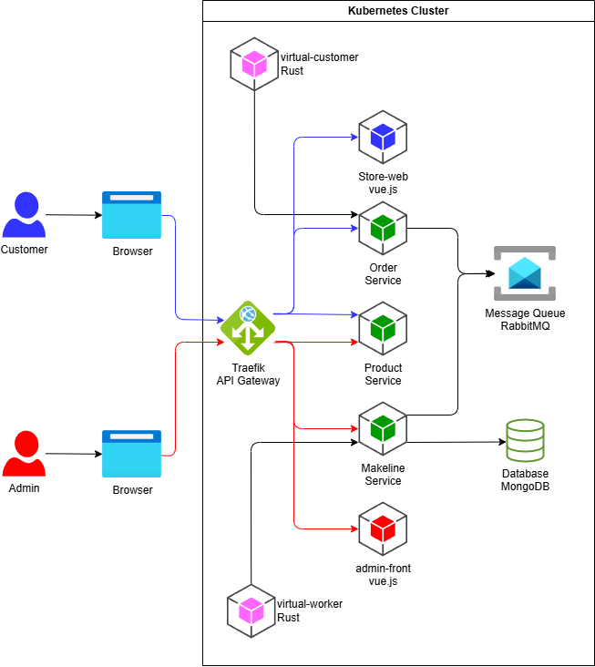

# Példa nagy házi feladat specifikáció

## Követelmény specifikáció

Egy webáruház rendszert kell megvalósítani, amely lehetővé teszi a vásárlók számára, hogy termékeket rendeljenek, és az üzlet dolgozói számára, hogy kezeljék a rendelések feldolgozását és a termékek kezelését.

- A vásárlók böngészhetnek a termékek között
- A vásárlók termékeket adhatnak a kosarukhoz és leadhatják a rendeléseiket
- Az üzlet dolgozói megtekinthetik a sorban lévő rendelések listáját
- Az üzlet dolgozói megtekinthetik a megrendelések részleteit és kezelhetik azok állapotát (Pending, Completed)
- Az üzlet dolgozói CRUD műveleteket végezhetnek a termékeken (létrehozás, megtekintés, módosítás, törlés)
- A rendszer teszteléséhez virtuális vásárlók és dolgozók szimulálják a rendelés leadását és teljesítését

## Architektúra és technológiák

A szolgáltatások konténerizált mikroszolgáltatásokként lesznek megvalósítva kubernetes környezetben.

A szolgáltatások vágása elsősorban felhasználói történeteken alapul: ügyfél oldali megrendelési funkciók, adminisztrátori megrendelési funkciók, általános termékekkel kapcsolatos funkciók. A megrendeléseket kezelő szolgáltatások üzenetsoron keresztül kommunikálnak a laza csatolás érdekében.

Az ügyfeleknek és az adminisztrátoroknak külön frontend alkalmazás készül, amelyek API Gateway-en keresztül kommunikálnak a backend szolgáltatásokkal.

A komponensek listája, rövid leírása és technológiái a következők:

| Szolgáltatás        | Technológia | Leírás                                                                                                                         |
| ------------------- | ----------- | ------------------------------------------------------------------------------------------------------------------------------ |
| store-front         | Vue.js      | Webalkalmazás, amelyen keresztül a vásárlók rendeléseket adhatnak le                                                           |
| store-admin         | Vue.js      | Webalkalmazás, amelyet az üzlet dolgozói használnak a sorban lévő rendelések megtekintésére és a termékek kezelésére           |
| product-service     | Rust        | Ez a szolgáltatás a termékek CRUD műveleteit végzi memóriában, perzisztens tár nélkül                                          |
| order-service       | Javascript  | Ez a szolgáltatás a rendelések leadására szolgál, ami az üzenetsorba küld üzeneteket                                           |
| makeline-service    | Golang      | Ez a szolgáltatás kezeli a rendelések feldolgozását, perzisztálását üzenetsorból és üzleti műveletekent nyújt a megrendeléshez |
| megrendelések db    | MongoDB     | NoSQL adatbázis a megrendelések adatainak tárolásához                                                                          |
| aszinkron üzenetsor | RabbitMQ    | Aszinkron üzenetsor a megrendelések kezelésére                                                                                 |
| API Gateway         | Traefik     | Az alkalmazás publikus belépési pontjai a frontendek felől                                                                     |
| virtual-customer    | Rust        | Ütemezetten szimulálja a rendelés létrehozását                                                                                 |
| virtual-worker      | Rust        | Ütemezetten szimulálja a rendelés teljesítését                                                                                 |

A komponensek közötti kapcsolatok az alábbi ábrán láthatók:

